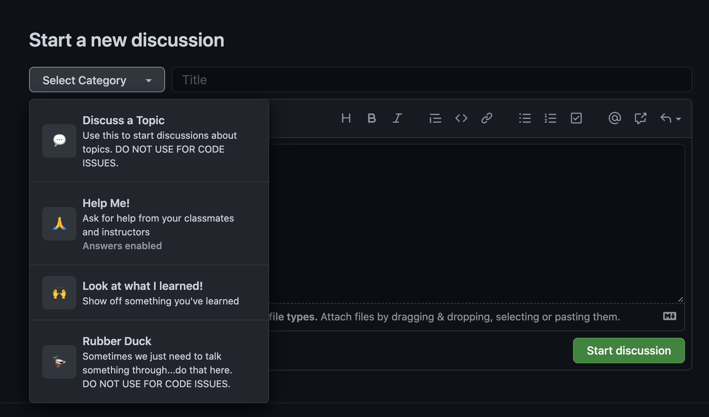

# Student Help
This repo will help instructors and students help each other with code and any other issues related to the coursework.

[Here is a resource](https://guides.github.com/features/mastering-markdown/) to help you learn about markdown to style your code and submissions.

## How to ask for help
Before getting started, review these 2 discussions and submit your responses them
- [Welcome to Cohort 14!](https://github.com/nss-evening-cohort-14/evening-client-side/discussions/1)
- [How to ask for help](https://github.com/nss-evening-cohort-14/evening-client-side/discussions/2)

## Start a discussion

### Step 1 - Go to the discussions tab
- Navigate to [Discussions](https://github.com/nss-evening-cohort-14/evening-client-side/discussions)

### Step 2 - Search
- Search all discussions to see if someone else had your same issue. If there is a similar discussion about what you want to talk about, add your response/question.
- If your topic does not yet exist, go to step 3 to create a new discussion.

### Step 3 - Create new discussion
- Click "New Discussion"

### Step 4 - Complete the Form
- "Select Category" to select the type of discussion you would like to submit
> 

### Step 5 - Add a Title and Description
- Add a description of what you need help with in the **Title**
- Follow the rules for [Asking for Help](https://github.com/nss-evening-cohort-14/evening-client-side/discussions/2)

### Step 6 - Start Discussion
- Click "Start Discussion"

### Step 7 - Await responses
- Continue searching for a solution to your issue **(If you find a solution, add a comment with your solution then remove the help wanted tag and add issue resolved)**
- See if you can help another classmate
- Patiently await help
> 

